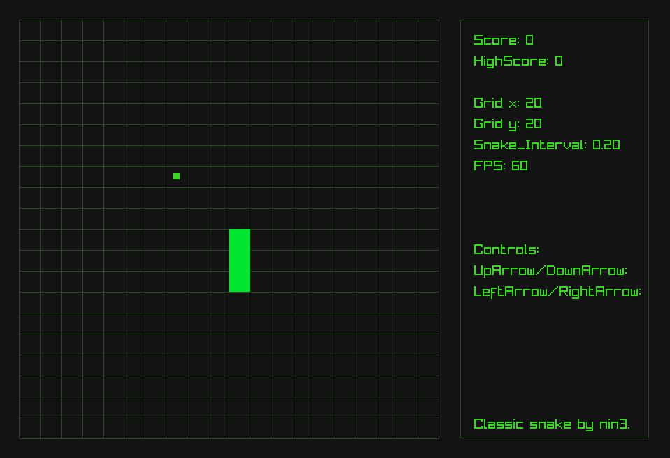

# Snake 🐍 - My Second C++ mini project

## Description

This is a simple implementation of the classic game Snake, written in C++. The game features a snake that grows in length when it eats food. The game ends when the snake collides with itself. This project helped me to improve my understanding of C++ and game development concepts.

## Screenshots

Here are some screenshots of the game:

## How to Play

Use the arrow keys to control the direction of the snake. The goal is to eat as much food as possible without colliding with yourself. The game ends when the snake collides with itself.

## Installation

To install and run the game, follow these steps:

1. Clone the repository to your local machine.
2. Open the project in your preferred C++ IDE.
3. Build and compile the code.
4. Run the executable file to start the game.

## What I've learned

1. The use of header files and classes in C++, which helped me structure my code in a more organized and reusable way.
2. How to work with pointers in C++, including allocating and freeing memory.
